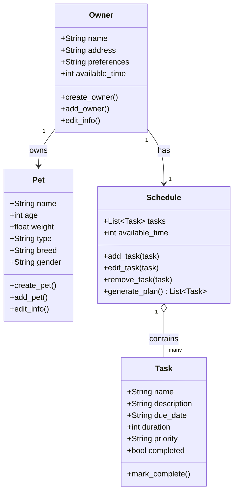

# PawPal+ UML Class Diagram

```mermaid
classDiagram
    class Owner {
        +String name
        +String address
        +String preferences
        +int available_time
        +create_owner()
        +add_owner()
        +edit_info()
    }

    class Pet {
        +String name
        +int age
        +float weight
        +String type
        +String breed
        +String gender
        +create_pet()
        +add_pet()
        +edit_info()
    }

    class Task {
        +String name
        +String description
        +String due_date
        +int duration
        +String priority
        +bool completed
        +mark_complete()
    }

    class Schedule {
        +List~Task~ tasks
        +int available_time
        +add_task(task)
        +edit_task(task)
        +remove_task(task)
        +generate_plan() List~Task~
    }

    Owner "1" --> "1" Pet : owns
    Owner "1" --> "1" Schedule : has
    Schedule "1" o-- "many" Task : contains
```
